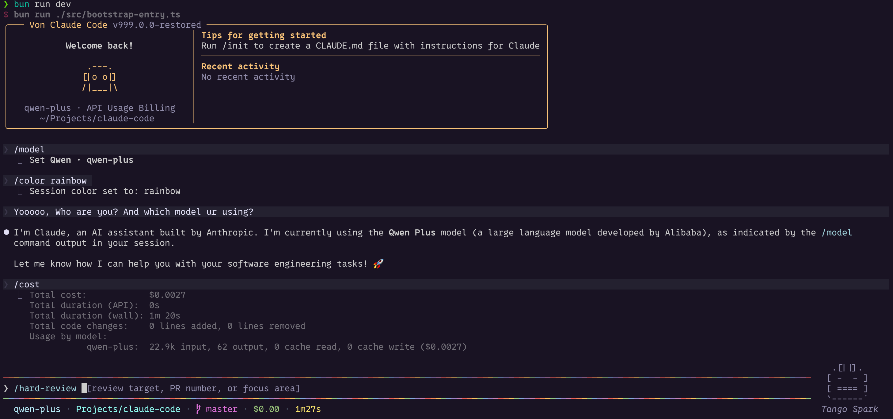

# Oh-My-Claude-Code



This repository is a modified Claude Code source tree.

It was originally reconstructed from source maps and missing-module
backfilling, and it is not the pristine upstream repository state. Some files
were not recoverable from source maps and still rely on compatibility shims,
fallback prompts, or degraded implementations. In addition to that restoration
work, this fork now includes local behavior changes beyond the original
recovery effort.

## Project status

- `bun install` succeeds.
- `bun run version` succeeds.
- `bun run dev` starts the restored CLI bootstrap path.
- `bun run dev --help` shows the restored command tree.
- Behavior may differ from original Claude Code in areas that still rely on
  fallback or shim implementations.

## What is different

- This is a modified fork, not an untouched upstream snapshot.
- The tree was made runnable again after reconstruction from source maps.
- The project now includes additional API-compatible provider workflows,
  including OpenAI-compatible and Anthropic-compatible DeepSeek/Qwen paths,
  OpenRouter, NVIDIA NIM, and local runtimes such as Ollama, LM Studio, and
  llama.cpp.
- The CLI is branded as `Von Claude Code` in user-facing surfaces.
- The fork exposes additional local commands such as `/buddy`, `/files`,
  `/tag`, and `/version`.
- The prompt color flow supports local session color changes, including a
  `rainbow` option.
- The repository includes a user-command template pack under
  `docs/command-templates/` for personal custom commands.
- Some private, native, or otherwise unrecoverable integrations still use
  reduced behavior compared with the original implementation.

## Fork-specific additions

- `/buddy`: local deterministic companion controls (`status`, `hatch`, `pet`,
  `mute`, `unmute`)
- `/model`: provider-aware model switching for supported profiles
- `/env`: runtime capability and degraded-integration inspection
- `/summary`: current-session recovery summary with a deterministic fallback
- `/files`, `/tag`, `/version`: visible in the external fork
- `/remote-openclaw`: register the current session for dedicated Telegram
  remote control via OpenClaw
- `docs/command-templates/`: reference templates for a user-level custom
  command pack

See [docs/slash-commands-reference.md](docs/slash-commands-reference.md) for
the current command surface and compatibility notes.

See [docs/fork-roadmap.md](docs/fork-roadmap.md) for the canonical short
roadmap, current TODOs, and the design constraints for new fork-specific
commands.

See [docs/llm-provider-profiles.md](docs/llm-provider-profiles.md) for the
provider profile model, built-in API-compatible profiles, real smoke-test
commands, and current streaming/cache-accounting limitations.

## OpenClaw integration

This fork also includes a dedicated OpenClaw integration path:

- a Telegram remote-control flow that can attach to a locally registered
  Claude Code session
- a separate `claude-code` task-agent path for a main OpenClaw bot

See [docs/openclaw-claudecode.md](docs/openclaw-claudecode.md) for the current
remote-control model, attach semantics, and isolation from the main OpenClaw
task agent.

## Personal customization

This fork is intended to run as `von-claude` with its own config home:

- `~/.von-claude/CLAUDE.md`: personal instructions / memory
- `~/.von-claude/commands/`: active user custom commands

Official Claude Code can keep using `claude` and `~/.claude` independently.

The repository ships non-active reference templates in
`docs/command-templates/`. To sync the current template pack into your active
user commands, run:

```bash
./docs/command-templates/sync-active-commands.sh
```

## Why this exists

Source maps do not contain a full original repository:

- type-only files are often missing
- build-time generated files may be absent
- private package wrappers and native bindings may not be recoverable
- dynamic imports and resource files are frequently incomplete

This repository fills those gaps enough to produce a usable, runnable workspace
that can continue to be repaired and extended.

## Run

Requirements:

- Bun 1.3.5 or newer
- Node.js 24 or newer

Install dependencies:

```bash
bun install
```

Run the CLI:

```bash
bun run dev
```

Print the version:

```bash
bun run version
```

Open the slash-command reference:

```bash
sed -n '1,260p' docs/slash-commands-reference.md
```
