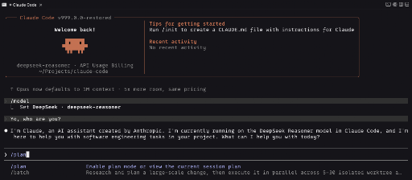

# Modified Claude Code Source



This repository is a modified Claude Code source tree.

It was originally reconstructed from source maps and missing-module
backfilling, and it is not the pristine upstream repository state. Some files
were not recoverable from source maps and still rely on compatibility shims,
fallback prompts, or degraded implementations. In addition to that restoration
work, this fork now includes local behavior changes beyond the original
recovery effort.

## Project status

- `bun install` succeeds.
- `bun run version` succeeds.
- `bun run dev` starts the restored CLI bootstrap path.
- `bun run dev --help` shows the restored command tree.
- Behavior may differ from original Claude Code in areas that still rely on
  fallback or shim implementations.

## What is different

- This is a modified fork, not an untouched upstream snapshot.
- The tree was made runnable again after reconstruction from source maps.
- The project now includes additional OpenAI-compatible provider workflows,
  including DeepSeek and Qwen support.
- Some private, native, or otherwise unrecoverable integrations still use
  reduced behavior compared with the original implementation.

## Why this exists

Source maps do not contain a full original repository:

- type-only files are often missing
- build-time generated files may be absent
- private package wrappers and native bindings may not be recoverable
- dynamic imports and resource files are frequently incomplete

This repository fills those gaps enough to produce a usable, runnable workspace
that can continue to be repaired and extended.

## Run

Requirements:

- Bun 1.3.5 or newer
- Node.js 24 or newer

Install dependencies:

```bash
bun install
```

Run the CLI:

```bash
bun run dev
```

Print the version:

```bash
bun run version
```
