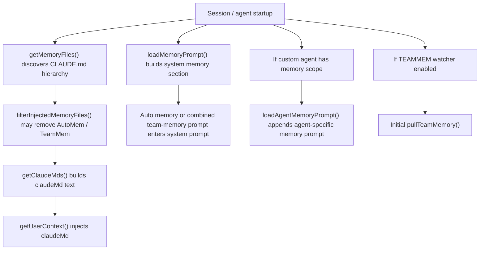
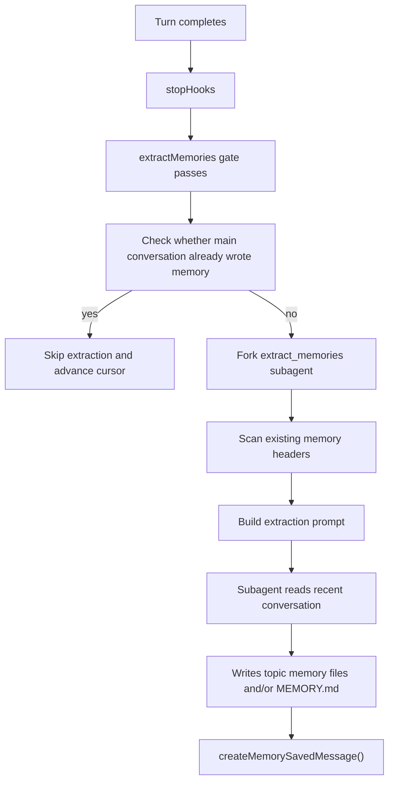
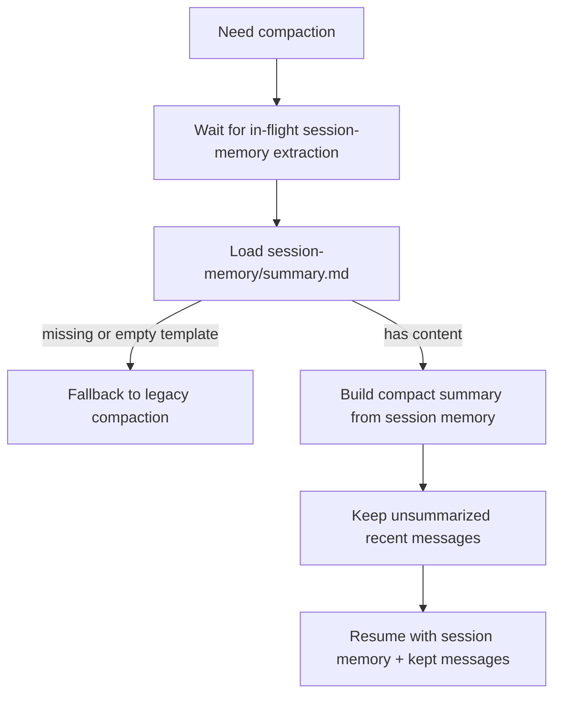
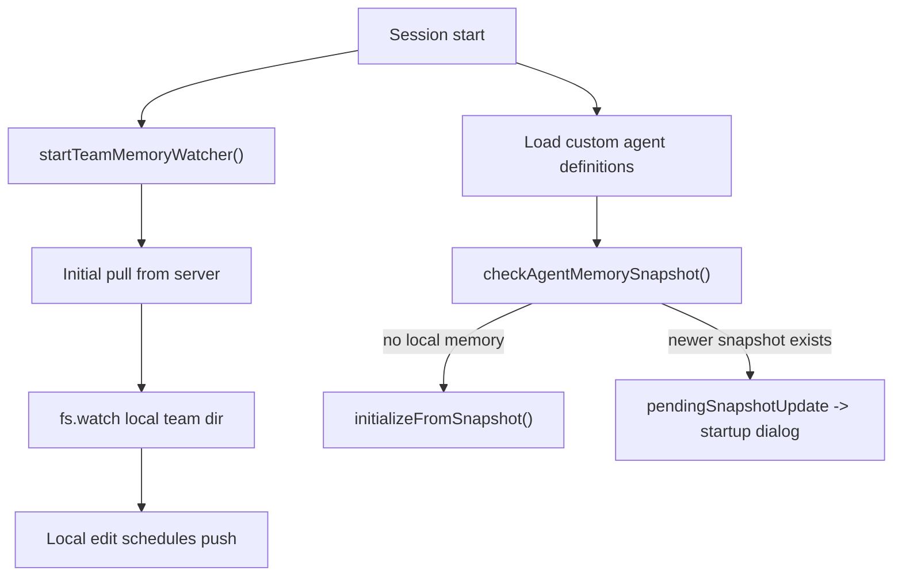

# Report on the Internal Memory Implementation of Claude Code

## 0. Purpose and Method

This document answers three questions:

1. What kinds of memory exist inside Claude Code, and what exactly are they?
2. When are they generated?
3. How are they generated, managed, organized, queried, injected, and used?

This report treats the current recovered source tree as the primary factual source. It does **not** treat the public documentation as the source of implementation truth. Official documentation is used only to clarify outward-facing terminology.

Methodologically, the investigation proceeded as follows:

- First, all relevant modules were organized by **persistence layer** and **prompt-injection layer**.
- For each conclusion, at least three evidence chains were checked:
  - the write path,
  - the read path,
  - and the runtime usage path.
- Any part that could not be verified directly in the current recovered tree is explicitly marked as an **evidence gap**, rather than being filled in speculatively.

External reference material:

- Anthropic’s official documentation primarily describes memory in terms of the layered `CLAUDE.md` file system.

The conclusion up front is this: **inside Claude Code, memory is not a single subsystem. It is a multi-layer context continuity system.** If one looks only at the public documentation, one may mistake the system for merely `CLAUDE.md`. If one looks only at the `agent-memory` directory, one may mistake it for the long-term memory of one specific agent. The actual source tree contains at least the following layers:

- `CLAUDE.md` as instruction memory
- Auto memory / memdir as persistent long-term memory
- Team memory as shared long-term memory
- Session memory as current-session summary memory
- Relevant memory retrieval / surfacing as the dynamic recall layer
- Agent memory as per-agent persistent memory
- Agent memory snapshot as the initialization / update propagation mechanism from project to agent memory
- Session transcript / JSONL as the persistent substrate
- Agent progress summary as a UI-oriented summary state
- Context collapse, which in the current recovered tree is effectively a stub rather than an active memory subsystem

---

## 1. Unified Terminology

To avoid conflating distinct layers, this document uses the following terms.

### 1.1 Instruction memory

This refers to the `CLAUDE.md` family of files: rules, instructions, collaboration preferences, and project-level guidance. Their characteristics are:

- they exist as documents,
- they are loaded wholesale into context at startup,
- they behave more like persistent instructions and working constraints,
- and they are not necessarily auto-generated.

Primary source entry points:

- `src/utils/claudemd.ts`
- `src/context.ts`

### 1.2 Durable memory

This refers to topic memory files saved for cross-session reuse. Their characteristics are:

- file-level persistence,
- topic-based organization,
- writable either explicitly by the model or automatically by a background subagent,
- and retrievable again in future sessions.

Primary source entry points:

- `src/memdir/*`
- `src/services/extractMemories/*`
- `src/services/autoDream/*`

### 1.3 Session continuity

This refers to a structured summary maintained specifically for continuity **within the current session**, rather than for long-term cross-project reuse. It is closer to a continuity carrier that allows work to resume after compaction.

Primary source entry points:

- `src/services/SessionMemory/*`
- `src/services/compact/sessionMemoryCompact.ts`

### 1.4 Transcript substrate

This refers to the infrastructure layer of JSONL transcripts, agent transcripts, and resume/load flows. It is not memory in itself, but many memory subsystems depend on it.

Primary source entry point:

- `src/utils/sessionStorage.ts`

### 1.5 Summary state

This refers to summary state used for the UI or for short-term coordination, rather than durable memory.

Primary source entry point:

- `src/services/AgentSummary/agentSummary.ts`

---

## 2. Bird’s-Eye Summary Table

| Layer | Strictly a memory layer? | Definition | Primary storage location | Primary generation time | Primary usage |
| --- | --- | --- | --- | --- | --- |
| `CLAUDE.md` layered system | Yes, but mainly instruction memory | Rules, preferences, collaboration constraints, project notes | `CLAUDE.md`, `.claude/CLAUDE.md`, `.claude/rules/*.md`, `~/.claude/CLAUDE.md`, `CLAUDE.local.md`, etc. | Discovered and loaded during startup / context construction; usually maintained by humans | Injected directly into user context |
| Auto memory / memdir | Yes | User long-term memory organized as topic files | `<memoryBase>/projects/<sanitized-root>/memory/` | Explicit save, background extraction, auto-dream consolidation | `MEMORY.md` index injection + dynamic relevant-memory recall |
| Team memory | Yes | Team-shared long-term memory | `<autoMemPath>/team/` | Explicit save, background extraction, synchronized pull/push | Team entrypoint injection or dynamic recall; synchronized across sessions |
| Session memory | Yes, but oriented toward session continuity | Structured summary of the current session | `{projectDir}/{sessionId}/session-memory/summary.md` | Background extraction after thresholds are met | Compaction and post-resume continuity |
| Relevant memory surfacing | No; this is a recall layer, not a persistence layer | Selects the most relevant memory files for the current query and injects them | In-memory attachment state | Generated asynchronously when needed | Injected as `<system-reminder>` |
| Agent memory | Yes | Persistent memory specific to a given agent type | `agent-memory/`, `agent-memory-local/`, etc. | Available whenever an agent definition enables `memory` | Appended to that agent’s system prompt |
| Agent memory snapshot | Not a primary memory layer, but a propagation mechanism | Project snapshot used to initialize or update agent memory | `.claude/agent-memory-snapshots/<agentType>/` | Checked before agent startup | Initializes agent memory or prompts merge/replace |
| Session transcript / JSONL | No; this is the substrate | Full session log | `~/.claude/projects/<project>/<session>.jsonl` | Continuously written throughout the session | Resume, extraction, search, compaction |
| Agent progress summary | No durable memory | Short progress phrase for UI display | In-memory task state | Summarized roughly every 30 seconds in the background | UI display |
| Context collapse | Not an active memory subsystem in the current tree | Intended context compression / folding interface | Interface exists | Currently disabled | Effectively inactive in the recovered tree |

---

## 3. Public Documentation and Source Implementation Are Not the Same Layer

The official documentation mainly presents Claude Code memory in terms of three files:

- project memory: `./CLAUDE.md`
- user memory: `~/.claude/CLAUDE.md`
- local project memory: `./CLAUDE.local.md`

That is the **outward-facing conceptual layer**.

In the source implementation, however, “memory” expands into a much larger system:

- `CLAUDE.md` is instruction memory,
- `memdir` is durable memory,
- `SessionMemory` is session continuity,
- `agentMemory` is per-agent durable memory,
- `TeamMemorySync` is shared durable-memory propagation.

So if the question is “How is memory implemented internally in Claude Code?”, the answer cannot stop at `CLAUDE.md`.

---

## 4. Layer One: `CLAUDE.md` as Instruction Memory

## 4.1 Definition

At the top of `src/utils/claudemd.ts`, the loading order and precedence are defined directly:

1. Managed memory, e.g. `/etc/claude-code/CLAUDE.md`
2. User memory: `~/.claude/CLAUDE.md`
3. Project memory: `CLAUDE.md`, `.claude/CLAUDE.md`, `.claude/rules/*.md`
4. Local memory: `CLAUDE.local.md`

Key points:

- These files are “instructions / memory files,” not memdir topic memory files.
- They are loaded in inverse priority order, so more local files take precedence over more global files.
- `@include` is supported.

Relevant source locations:

- `src/utils/claudemd.ts`
- `getMemoryFiles()`
- `src/context.ts`
- `getUserContext()`

## 4.2 Content form

This layer is fundamentally a text instruction layer. It is **not** required to use the topic frontmatter format of memdir.

`parseMemoryFileContent()` performs several operations:

- stripping frontmatter,
- stripping HTML comments,
- resolving `@include`,
- and applying truncation safeguards for the `AutoMem` / `TeamMem` entrypoints.

Its runtime carrier in the recovered tree is `MemoryFileInfo`, with fields such as:

- `path`
- `type`
- `content`
- `parent`
- `globs`
- `contentDiffersFromDisk`
- `rawContent`

The `type` here refers to the instruction-memory type system under `src/utils/memory/types.js`; it is **not** the same as the memdir taxonomy of `user/feedback/project/reference`.

## 4.3 When it is generated

This layer is usually not auto-generated. In practice it is:

- maintained manually by the user or team,
- or potentially generated by other product features not verifiable in the current tree.

## 4.4 How it is managed and organized

Its organization mechanism is **hierarchical override plus upward directory discovery**:

- user-level files are loaded from the user’s home directory,
- project/local files are discovered by walking upward from the current working directory to the root,
- files closer to the current directory take precedence,
- `.claude/rules/*.md` is treated as part of project memory.

## 4.5 How it is queried and used

This layer is **not** query-retrieved. It is loaded wholesale at startup.

The key call chain is:

1. `src/context.ts` calls `getUserContext()`
2. which calls `getClaudeMds(filterInjectedMemoryFiles(await getMemoryFiles()))`
3. which constructs the `claudeMd` field
4. which is then injected as a prefix into the user context

In other words, this layer is used by default as:

- **loaded at startup,**
- **not query-time search,**
- **not topic recall.**

## 4.6 Relationship to auto memory

Although `AutoMem` and `TeamMem` also pass through `getMemoryFiles()`, the source treats them as a **different memory system**.

When `tengu_moth_copse` is enabled, `filterInjectedMemoryFiles()` removes `AutoMem` and `TeamMem` from the directly injected list, so they instead go through dynamic surfacing.

This distinction is critical:

- the `CLAUDE.md` system is always-on injection,
- while memdir memory may instead use dynamic recall.

---

## 5. Layer Two: Auto Memory / Memdir as Long-Term Durable Memory

This is the core of Claude Code’s internal long-term memory system.

## 5.1 Definition

This system lives under `src/memdir/*`.

Its core principle is **not** “store everything.” Rather, it stores only context that:

- cannot be inferred from the current project state, and
- is worth preserving across sessions.

The top-level comments in `src/memdir/memoryTypes.ts` are explicit that the following are considered derivable and therefore should **not** be stored as durable memory:

- code patterns,
- architecture,
- git history,
- file structure.

## 5.2 Taxonomy: only four types

`src/memdir/memoryTypes.ts` defines a fixed four-way taxonomy:

- `user`
- `feedback`
- `project`
- `reference`

These are the official categories of durable memory.

### `user`

Stores the user’s role, preferences, responsibilities, and knowledge background, so that future collaboration can adapt to that person more effectively.

### `feedback`

Stores user corrections or confirmations about the working style and collaboration method.

This category is especially important because it allows the system to inherit:

- which methods should not be repeated,
- and which non-obvious methods the user has already confirmed to be effective.

### `project`

Stores non-code project context, for example:

- who is doing what,
- why something is being done,
- deadlines,
- merge freezes,
- compliance-driven constraints.

The key idea is that these are **not** facts that can simply be derived from code or git history.

### `reference`

Stores index pointers into external systems, for example:

- a Linear project,
- a Grafana dashboard,
- a Slack channel.

In essence, these memories answer the question: **where should the system look for the latest external state?**

## 5.3 What explicitly should **not** be stored

`WHAT_NOT_TO_SAVE_SECTION` explicitly excludes:

- code patterns / conventions / architecture / file paths / project structure,
- git history / recent changes / who changed what,
- debugging solutions / fix recipes,
- anything already written in `CLAUDE.md`,
- and temporary task details from the current session.

This means memdir is not a general-purpose knowledge base. It is a conservative layer for **non-derivable context**.

## 5.4 Storage paths

Path resolution is defined in `src/memdir/paths.ts`.

### Whether it is enabled

`isAutoMemoryEnabled()` checks, in order:

1. `CLAUDE_CODE_DISABLE_AUTO_MEMORY`
2. SIMPLE / bare mode
3. remote mode without persistent storage
4. the `autoMemoryEnabled` setting
5. default `true`

### Directory path

`getAutoMemPath()` resolves in the following order:

1. `CLAUDE_COWORK_MEMORY_PATH_OVERRIDE`
2. trusted setting `autoMemoryDirectory`
3. default `<memoryBase>/projects/<sanitized-git-root>/memory/`

where:

- `<memoryBase>` comes from `getMemoryBaseDir()`,
- and the directory is namespaced by project root.

### The KAIROS branch

`loadMemoryPrompt()` contains an important branch:

- if `feature('KAIROS')` is enabled,
- and auto memory is enabled,
- and `getKairosActive()` is true,

then the normal auto/team memory prompt is bypassed and `buildAssistantDailyLogPrompt()` is used instead.

The semantics of this branch are:

- new memory is first written into an append-only daily log,
- paths look like `logs/YYYY/MM/YYYY-MM-DD.md`,
- and `MEMORY.md` becomes a nightly distilled index.

KAIROS daily-log mode takes precedence over TEAMMEM because an append-only log model is incompatible with team-sync semantics over a shared `MEMORY.md`.

### Entrypoint

The main index filename is fixed as:

- `MEMORY.md`

The relevant constants in `src/memdir/memdir.ts` include:

- `ENTRYPOINT_NAME = 'MEMORY.md'`
- `MAX_ENTRYPOINT_LINES = 200`
- `MAX_ENTRYPOINT_BYTES = 25_000`

## 5.5 Content format

Memdir durable memory has two layers.

### Layer A: `MEMORY.md`

This is the **index**, not the body text.

`buildMemoryPrompt()` constrains it as follows:

- one entry per line,
- roughly `~150` characters per entry,
- no frontmatter,
- and no dumping of full memory bodies into `MEMORY.md`.

### Layer B: topic memory files

Each actual memory lives in its own `.md` file and uses frontmatter.

The frontmatter example under `MEMORY_FRONTMATTER_EXAMPLE` centers on:

- `name`
- `description`
- `type`

The `type` must belong to the four-way taxonomy above.

## 5.6 When it is generated

Auto memory has three primary generation paths.

### Path 1: explicit save by the main model

When the main model decides to save memory according to the memory prompt, it directly uses file-editing / writing tools inside the memory directory.

This is the **explicit save** path.

### Path 2: background `extractMemories`

`src/services/extractMemories/extractMemories.ts` launches a background forked agent during stop hooks to extract durable memory from newly added messages.

The call chain is:

- `src/utils/backgroundHousekeeping.ts` -> `initExtractMemories()`
- and then `src/query/stopHooks.ts` at the end of each turn

Key behavior includes:

- maintaining `lastMemoryMessageUuid` as a cursor so only new messages are processed,
- skipping extraction if the main conversation has already written memory files, via `hasMemoryWritesSince()`,
- throttling using `turnsSinceLastExtraction`,
- performing the actual read/write work in the forked agent,
- appending a system message to the main thread via `createMemorySavedMessage()` after success.

The tool permissions of this subagent are extremely narrow:

- read-type tools are allowed,
- read-only Bash is allowed,
- and `Edit` / `Write` are allowed only within the memory directory.

### Path 3: background `autoDream` consolidation

`src/services/autoDream/autoDream.ts` implements memory consolidation.

This is not the path that creates memory for the first time. It performs higher-level reorganization, merging, and index maintenance over already existing memory.

Its trigger conditions include:

- auto memory enabled,
- auto-dream gate enabled,
- not in remote mode,
- not in KAIROS mode,
- at least `minHours` since the last consolidation, default `24`,
- at least `minSessions` since the last consolidation, default `5`,
- and successful acquisition of a consolidation lock.

So `extractMemories` behaves more like incremental extraction, whereas `autoDream` behaves more like periodic cleanup and reorganization.

## 5.7 How it is organized

It is organized by **topic**, not by timeline.

The prompt explicitly requires:

- organize semantically by topic, not chronologically,
- update existing memory instead of creating endless duplicates,
- update or remove memories that have become stale.

So the normative durable-memory form is:

- `MEMORY.md` as the topic index,
- topic files as the detailed bodies,
- and the directory as a continuously maintainable semantic knowledge graph.

## 5.8 How it is queried

Auto memory has two read modes.

### Mode A: read the `MEMORY.md` entrypoint

In the traditional mode, `MEMORY.md` itself is injected into context.

Its purpose is not to provide the full body of memory, but to tell the model what topics currently exist.

### Mode B: dynamic recall by query

`src/memdir/findRelevantMemories.ts` implements relevant-memory selection:

1. `scanMemoryFiles()` scans all `.md` files in the memory directory except `MEMORY.md`
2. only frontmatter is read to build a manifest
3. `sideQuery()` is called, and the default Sonnet model selects up to 5 clearly relevant memory files
4. absolute paths and `mtimeMs` are returned

Crucially, this is **not** a vector database and **not** embedding retrieval.

It is:

- filesystem scanning,
- frontmatter manifest construction,
- and then LLM-based file selection.

A few implementation details that are easy to miss:

- `scanMemoryFiles()` keeps at most `200` candidate headers,
- only roughly the first `30` lines of each candidate are read to obtain frontmatter,
- the selector filters out `alreadySurfaced`,
- and if `recentTools` is supplied, it tries to avoid resurfacing tool reference documents already in current use.

## 5.9 How it is injected into the conversation

`src/utils/attachments.ts` and `src/utils/messages.ts` are responsible for relevant-memory surfacing.

The pipeline is:

1. `getRelevantMemoryAttachments()` determines which directory should be searched based on the input
2. if the input mentions `@agent-xxx`, that agent’s memory directory is searched first
3. otherwise the auto-memory directory is searched
4. `findRelevantMemories()` selects up to 5 files
5. `readMemoriesForSurfacing()` reads and length-trims their contents
6. a `relevant_memories` attachment is created
7. `messages.ts` wraps it inside `<system-reminder>`

Key implementation details:

- at most 5 memory files are surfaced per round,
- previously surfaced files are deduplicated,
- cumulative surfaced bytes are tracked within the session to prevent unbounded reinjection,
- if a file is too long, it is truncated with an explicit truncation note rather than being dropped entirely.

## 5.10 When memory should be accessed

`WHEN_TO_ACCESS_SECTION` is very explicit:

- memory should be accessed when memory is relevant,
- it **must** be accessed when the user explicitly asks to recall / check / remember,
- if the user says “ignore memory” or “do not use memory,” it should be treated as though it does not exist,
- memory may be stale, so it should be verified against the current codebase or external state before being trusted.

So memory is designed as:

- **context enhancement,**
- **not ground truth for current facts.**

---

## 6. Layer Three: Team Memory

Team memory is a shared variant of auto memory, not an entirely separate system.

## 6.1 Definition

`src/memdir/teamMemPaths.ts` makes the following points explicit:

- Team memory is a subdirectory of auto memory,
- it requires auto memory to be enabled,
- and it is feature-gated.

Paths include:

- `getTeamMemPath()` -> `<autoMemPath>/team/`
- `getTeamMemEntrypoint()` -> `<autoMemPath>/team/MEMORY.md`

## 6.2 Content model

Team memory still uses the same four-type taxonomy:

- `user`
- `feedback`
- `project`
- `reference`

However, `src/memdir/teamMemPrompts.ts` adds scope constraints in combined mode:

- `user`: always private
- `feedback`: private by default; only project-wide rules belong in team memory
- `project`: may be private or team, but strongly biased toward team
- `reference`: usually team-scoped

So team memory is not a new taxonomy. It is the **same taxonomy with an extended notion of scope**.

## 6.3 When it is generated

There are three generation sources:

1. explicit save by the user or the main model into the team directory,
2. automatic writes by `extractMemories` under the combined prompt,
3. initial pull from the server at session startup.

## 6.4 How it is synchronized

Synchronization logic lives in `src/services/teamMemorySync/index.ts` and `watcher.ts`.

### Server-side model

The source comments describe the API contract as:

- `GET /api/claude_code/team_memory?repo=...`
- `GET /api/claude_code/team_memory?repo=...&view=hashes`
- `PUT /api/claude_code/team_memory?repo=...`

The repository granularity is identified by a GitHub repo slug.

### Pull semantics

A pull means:

- server content overwrites local files,
- server values win at the key level,
- `serverChecksums` is refreshed.

### Push semantics

A push means:

- only deltas that differ from `serverChecksums` are uploaded,
- the server performs an upsert,
- keys absent from the PUT payload are preserved on the server.

### Delete semantics

**Deletion does not propagate.**

The source comments are explicit:

- deleting a local file does not delete the corresponding server entry,
- and the next pull will restore it.

So team memory is **not** a strongly consistent bidirectional deletion sync system.

### Conflict semantics

Conflicts use optimistic locking:

- `If-Match`
- if the server returns `412`,
- the client fetches only hashes through `?view=hashes`,
- recomputes the delta,
- and retries.

Importantly, there is no content-level merge.

The intended semantics are:

- pull: **server wins**
- push conflict: **local edit wins for the conflicting key**

The comments explain why: if the push was triggered by the user’s own fresh local edit, silently discarding that edit would be worse.

## 6.5 When synchronization happens

`startTeamMemoryWatcher()` in `src/services/teamMemorySync/watcher.ts` does the following:

1. pull once at session start,
2. start `fs.watch` regardless of whether the server already has content,
3. trigger push through the watcher and `notifyTeamMemoryWrite()` when local writes occur.

So the propagation model is:

- **pull at session start**
- **watch + debounced push during runtime**

## 6.6 Security and boundaries

This is the most heavily defended layer in the entire memory system.

### Path safety

`teamMemPaths.ts` explicitly defends against:

- null bytes,
- URL-encoded traversal,
- Unicode-normalization traversal,
- backslash traversal,
- absolute paths,
- symlink escape,
- dangling symlinks,
- symlink loops.

The core error type is `PathTraversalError`.

### Secret protection

Before push, `readLocalTeamMemory()` scans every file via `scanForSecrets()`:

- if a secret is detected, that file is skipped and not uploaded,
- `skippedSecrets` is recorded,
- only the secret type label is logged, not the secret value itself.

### Size and entry count limits

Client-side limits include:

- `MAX_FILE_SIZE_BYTES = 250_000`
- `MAX_PUT_BODY_BYTES = 200_000`

If the server returns a structured `413`, the client can learn:

- `serverMaxEntries`

and uses that limit to truncate future upload sets.

---

## 7. Layer Four: Session Memory

Session memory is the dedicated summary layer for **current-session continuity**.

The biggest difference from durable memory is:

- durable memory is for future cross-session reuse,
- session memory is for continuing the current session after compaction or resume.

## 7.1 Definition

The top-level comment in `src/services/SessionMemory/sessionMemory.ts` states that it:

- automatically maintains a Markdown file,
- containing notes about the current conversation,
- extracted periodically by a background forked subagent,
- without interrupting the main dialogue.

## 7.2 Storage location

`src/utils/permissions/filesystem.ts` defines the path format as:

- `{projectDir}/{sessionId}/session-memory/summary.md`

So this file is not globally shared. It is:

- project-scoped,
- session-scoped.

## 7.3 Content format

The default template in `src/services/SessionMemory/prompts.ts` includes sections such as:

- `# Session Title`
- `# Current State`
- `# Task specification`
- `# Files and Functions`
- `# Workflow`
- `# Errors & Corrections`
- `# Codebase and System Documentation`
- `# Learnings`
- `# Key results`
- `# Worklog`

This is not just advisory. It is a structural contract.  
The update prompt explicitly requires that:

- section headers must not be modified,
- italic section descriptions must not be modified,
- only the body text under each section description may be updated.

Length budgets are also defined:

- roughly `2000` tokens per section,
- roughly `12000` tokens for the full session memory.

## 7.4 When it is generated

The triggering logic in `shouldExtractMemory()` is very specific.

### Initialization threshold

It starts only when the total context token count reaches `minimumMessageTokensToInit`.

The default in `sessionMemoryUtils.ts` is:

- `10000`

### Subsequent update threshold

After initialization, each update further requires:

- at least `minimumTokensBetweenUpdate` new tokens since the last extraction,
- default `5000`

and one of the following:

- the tool-call count threshold is met, or
- the most recent assistant turn had no tool call, creating a natural breakpoint.

The source is explicit that:

- the token threshold is always a hard prerequisite,
- even if the tool-call threshold is met, extraction does not occur until the token threshold is reached.

### Additional runtime preconditions

Beyond thresholds, session memory also depends on:

- running only in the main REPL thread,
- not running for subagents / teammates,
- not running in remote mode,
- auto-compact being enabled,
- the `tengu_session_memory` gate being enabled.

## 7.5 How it is generated

The pipeline is:

1. `registerPostSamplingHook()` registers a background hook
2. `shouldExtractMemory()` decides whether extraction should happen
3. `setupSessionMemoryFile()` creates the directory and `summary.md`
4. the current summary content is read
5. `buildSessionMemoryUpdatePrompt()` is constructed
6. a forked agent is allowed to edit only that summary file
7. `lastSummarizedMessageId` is updated

The permission design is conservative:

- this is not a general memory writer,
- it is a **single-file summary maintainer**.

## 7.6 How it is managed and organized

Session memory is **not** a topic graph. It is a fixed-template document.

Its organizational dimensions are things like:

- current state,
- task specification,
- important files,
- command workflow,
- errors and corrections,
- learnings,
- key results,
- worklog.

So it behaves more like an **operational manual for compaction continuity** than like a durable knowledge base.

## 7.7 How it is queried and used

Its most important consumer is not the main conversation, but **compaction**.

`src/services/compact/sessionMemoryCompact.ts` shows that:

- `shouldUseSessionMemoryCompaction()` requires both `tengu_session_memory` and `tengu_sm_compact`,
- compaction waits for any in-flight session-memory extraction to finish,
- if session memory is missing, it returns `null`,
- if session memory contains only the empty template, it returns `null`,
- otherwise session memory is used to generate the compact summary.

So the core role of session memory is:

- to replace the legacy compact summary,
- and preserve stronger continuity after compression.

In resumed-session scenarios, even if `lastSummarizedMessageId` is unavailable, it can still function as the operative summary.

---

## 8. Layer Five: Relevant Memory Retrieval / Surfacing

This layer is often mistaken for “memory itself,” but it is really a retrieval-and-injection mechanism.

## 8.1 Definition

Its purpose is:

> based on the current query, select the most relevant durable memory files and inject them into the current context as a system reminder.

It is not a persistence layer.

## 8.2 Input sources

Candidates come from:

- the auto-memory directory,
- or, if the user mentions a specific agent in the input, that agent’s memory directory.

This routing logic lives in `getRelevantMemoryAttachments()` inside `src/utils/attachments.ts`.

## 8.3 Query method

This is not full-text retrieval plus ranking, and not embedding retrieval either.

The concrete procedure is:

1. `scanMemoryFiles()` reads roughly the first 30 lines of each `.md` file for frontmatter
2. a manifest is built in the format:
   - `[type] filename (timestamp): description`
3. `findRelevantMemories()` calls `sideQuery()`
4. the side model returns up to 5 filenames
5. those are mapped back to real file paths

Ranking information is therefore driven mainly by:

- filename,
- frontmatter description,
- frontmatter type,
- and modification time.

## 8.4 How it is injected

`readMemoriesForSurfacing()` reads the selected files and:

- applies line and byte limits,
- preserves the front section when truncating,
- adds an explicit truncation note when necessary.

Then `messages.ts` wraps the result as:

- `<system-reminder> ... </system-reminder>`

So the final surfaced memory is not a normal user message or a tool result. It is meta-context injected as a system reminder.

## 8.5 Deduplication and budget

The system scans existing messages for `relevant_memories` attachments:

- files already surfaced are not repeatedly resurfaced,
- cumulative surfaced bytes are tracked,
- after compaction, because old attachments are no longer in the transcript, the same memory may be surfaced again.

This shows that relevant-memory state is not a global cache. It is a **rolling recall state scoped to the current transcript lifecycle**.

---

## 9. Layer Six: Agent Memory in the Strict Sense

If the question is specifically “How is agent memory implemented?”, this is the section that matters most.

## 9.1 Definition

The comment in `src/tools/AgentTool/agentMemory.ts` states this directly:

- Persistent agent memory scope:
  - `user`
  - `project`
  - `local`

So agent memory is:

- directory-namespaced by agent type,
- scope-sensitive in storage location,
- and implemented with the same prompt-governed file-memory mechanism as memdir.

## 9.2 Storage locations

### `user`

- `<memoryBase>/agent-memory/<agentType>/`

### `project`

- `<cwd>/.claude/agent-memory/<agentType>/`

### `local`

Usually:

- `<cwd>/.claude/agent-memory-local/<agentType>/`

If `CLAUDE_CODE_REMOTE_MEMORY_DIR` is set, local scope is redirected into a project-namespaced directory under the remote mount.

## 9.3 Content format

Agent memory is **not** a separate file format. It directly reuses the memdir mechanism.

Inside `loadAgentMemoryPrompt()` the code:

- computes the agent memory directory,
- calls `ensureMemoryDirExists()`,
- calls `buildMemoryPrompt()`.

So agent memory inherits all of the following from memdir:

- the `MEMORY.md` index convention,
- topic memory files,
- frontmatter format,
- and the four-type taxonomy.

## 9.4 When it is generated

The prerequisite is that the agent definition declares a `memory` field.

In `src/tools/AgentTool/loadAgentsDir.ts`:

- `memory?: AgentMemoryScope`
- allowed values are `user` / `project` / `local`

Once an agent enables this field, its system prompt gains an additional `loadAgentMemoryPrompt(...)` section.

So the generation / activation timing of agent memory is not tied to a global background service. It is:

- the agent is defined with memory enabled,
- the agent starts,
- the agent can then read and write its own memory directory under prompt constraints.

## 9.5 How it is used

Agent memory is similar to auto memory in mechanism, but different in namespace granularity.

Shared characteristics:

- file-based memory,
- `MEMORY.md` + topic files,
- same taxonomy,
- same read/write prompt constraints.

Difference:

- auto memory is general durable memory for the user within the project,
- agent memory is a durable memory namespace dedicated to a specific agent type.

So agent memory is best described as:

- **namespaced durable memory**.

## 9.6 Scope semantics

`loadAgentMemoryPrompt()` adds different instructions depending on scope:

- `user`: what is learned should be as general as possible and reusable across projects
- `project`: memory should be adapted to the current project and shared with the team via version control
- `local`: memory should be adapted to the current project and current machine, but should not enter version control

One subtle but important point is that project-scope agent memory is described in comments as “shared with your team via version control.”  
So its sharing mechanism is **not** the team-memory sync service. It is ordinary project file sharing through VCS.

---

## 10. Layer Seven: Agent Memory Snapshot

This is not agent memory itself. It is the bootstrap / update propagation mechanism for agent memory.

## 10.1 Definition

`src/tools/AgentTool/agentMemorySnapshot.ts` defines a project snapshot directory:

- `.claude/agent-memory-snapshots/<agentType>/`

There are two important metadata files:

- `snapshot.json`
  - contains `updatedAt`
- `.snapshot-synced.json`
  - contains `syncedFrom`

## 10.2 Purpose

This mechanism solves the following problem:

- a custom agent may want to distribute recommended memory together with the project,
- user-scope agent memory may need to be initialized from the project snapshot on first use,
- and later snapshot updates may require the user to decide what to do with already-existing memory.

## 10.3 When it is triggered

When custom agent definitions are loaded, `initializeAgentMemorySnapshots()` checks every agent whose `memory === 'user'`.

If there is:

- no local agent memory -> action `initialize`
- local agent memory, but a newer snapshot -> action `prompt-update`

The return values of `checkAgentMemorySnapshot()` are:

- `none`
- `initialize`
- `prompt-update`

## 10.4 How initialization works

`initializeFromSnapshot()`:

- copies the `.md` files from the snapshot directory into the actual agent memory directory,
- writes `.snapshot-synced.json`.

## 10.5 How updates work

The recovered tree confirms the following behavior:

- if `pendingSnapshotUpdate` is detected at startup, `main.tsx` launches `SnapshotUpdateDialog`
- the user can choose:
  - `merge`
  - `keep`
  - `replace`

Among these:

- `replaceFromSnapshot()` deletes existing `.md` files and then copies the snapshot
- `markSnapshotSynced()` updates only the synchronization metadata, not the body text

### Evidence gap

Both `main.tsx` and `dialogLaunchers.tsx` reference `./components/agents/SnapshotUpdateDialog.js`, but that component file is absent from the recovered tree.

Therefore we can confirm:

- the three options `merge / keep / replace` exist,
- `merge` constructs a merge task using `buildMergePrompt(...)`,

but we **cannot** confirm:

- the exact UI wording inside the missing component,
- nor the exact full text of the merge prompt.

This should be treated as an evidence gap, not as an implementation claim.

---

## 11. Layer Eight: Session Transcript / JSONL as the Persistent Substrate

This is not itself a memory type, but many memory subsystems stand on top of it.

## 11.1 Definition

`src/utils/sessionStorage.ts` is responsible for:

- the main session transcript,
- subagent transcripts,
- load / resume,
- compaction boundaries,
- and various metadata snapshots.

## 11.2 Storage locations

Key path functions include:

- `getProjectsDir()` -> `~/.claude/projects`
- `getProjectDir(projectDir)` -> `~/.claude/projects/<sanitized-project-dir>`
- `getTranscriptPath()` -> `<projectDir>/<sessionId>.jsonl`

Subagent transcripts live under paths like:

- `<projectDir>/<sessionId>/subagents/.../agent-<agentId>.jsonl`

## 11.3 Content

This is an append-only JSONL transcript.

`loadTranscriptFile()` restores:

- transcript messages,
- summaries,
- custom titles,
- tags,
- agent names / colors / settings,
- PR links,
- worktree states,
- attribution snapshots,
- content replacements,
- context collapse entries.

So the transcript is a broad session-state log, not merely a chat log.

## 11.4 Why it matters

Because many memory features depend on the transcript:

- `extractMemories` extracts durable memory from newly added transcript messages,
- session memory is also extracted from conversation content,
- `buildSearchingPastContextSection()` explicitly teaches the model to grep transcript JSONL as a last-resort source of past context,
- compaction and resume rely on transcript-based recovery.

## 11.5 Why it is not itself the primary memory

Because it stores:

- full history,
- raw messages,
- runtime state,

rather than selectively preserved long-term semantic memory.

A more accurate characterization is:

- it is the **raw material of memory**,
- not the final memory form.

---

## 12. Layer Nine: Agent Progress Summary

This is easy to mistake for short-term agent memory, but in design it is much closer to UI state.

`src/services/AgentSummary/agentSummary.ts`:

- forks a summarizer roughly every 30 seconds,
- reads the current agent transcript,
- generates a 3–5 word present-tense progress phrase,
- stores it in `AgentProgress` for the UI.

Its characteristics are:

- periodic,
- no tools allowed,
- no writes into durable memory directories,
- no role in future recall.

So it should be categorized as:

- summary state,
- not durable memory.

---

## 13. Layer Ten: The Status of Context Collapse in the Recovered Tree

`src/services/contextCollapse/index.ts` is currently very close to a stub:

- `isContextCollapseEnabled()` returns `false`
- `applyCollapsesIfNeeded()` returns `{ changed: false }`
- `recoverFromOverflow()` returns the original messages

Therefore, in the current recovered tree:

- context collapse should **not** be treated as an active memory subsystem,
- at most one can say the transcript and compaction layers still retain related interfaces / data structures,
- but it is not operational on the main runtime path.

---

## 14. Re-answering the Question from the Perspective of “When Is It Generated?”

If the question is only “when is it generated?”, the answer can be summarized as follows.

| Type | Generation timing |
| --- | --- |
| `CLAUDE.md` instruction memory | Usually maintained by humans; discovered and loaded during startup / user-context construction |
| Auto memory | Explicit user/model save; background extraction after stop hooks; autoDream consolidation |
| Team memory | Same as auto memory, but may be written to the team directory; pulled at session start; pushed after local modification |
| Session memory | Background extraction after token and tool-call thresholds are met |
| Relevant memory attachments | Generated on demand during query-time prefetch; not persistent |
| Agent memory | Available for reading/writing once an agent with a `memory` field starts |
| Agent memory snapshot | Checked at agent startup if a project snapshot exists; may initialize or prompt update |
| Transcript JSONL | Written continuously throughout the conversation |
| Agent summary | Generated roughly every 30 seconds while the agent is running |

---

## 15. Re-answering the Question from the Perspective of “How It Is Generated / Managed / Organized / Queried / Used”

## 15.1 Generation

- `CLAUDE.md`
  - mainly human-maintained
- Auto / Team / Agent memory
  - explicit save,
  - background forked extractor,
  - periodic consolidation
- Session memory
  - background forked summarizer
- Relevant memory
  - temporary attachment generation at query time

## 15.2 Management

- `CLAUDE.md`
  - hierarchical override plus `@include`
- Auto / Team / Agent memory
  - topic files plus `MEMORY.md` index,
  - frontmatter maintaining `name / description / type`,
  - deduplication, updating, deletion
- Session memory
  - fixed-template document
- Transcript
  - append-only JSONL

## 15.3 Organization

- `CLAUDE.md`
  - organized by directory hierarchy
- durable memory
  - organized semantically by topic
- session memory
  - organized by fixed sections
- transcript
  - organized chronologically as a log

## 15.4 Querying

- `CLAUDE.md`
  - not query-retrieved; injected wholesale
- durable memory
  - through `MEMORY.md`,
  - or through relevant-memory selection over frontmatter manifest plus side model
- session memory
  - read directly by compaction
- transcript
  - read during restore / search / extraction

## 15.5 Usage

- `CLAUDE.md`
  - user context
- `loadMemoryPrompt()`
  - system-prompt memory section
- relevant memories
  - `<system-reminder>`
- session memory
  - compaction summary
- agent memory
  - appended to the corresponding agent’s system prompt

---

## 16. Four End-to-End Chains

## 16.1 Chain A: How memory is loaded at startup

Explanation:

- the `CLAUDE.md` family enters through user context,
- memdir rules enter through the system prompt memory section,
- relevant memory is injected later at query time,
- agent memory augments the corresponding agent’s system prompt.

## 16.2 Chain B: How durable memory is generated after a turn

Explanation:

- automatic durable-memory generation is not a casual side effect in the main thread,
- it is handled by a constrained forked subagent,
- and that subagent yields if the main thread already performed a memory write.

## 16.3 Chain C: How compaction / resume uses session memory and transcript

Explanation:

- the main battlefield of session memory is not ordinary dialogue,
- it is compaction continuity,
- and the transcript provides the boundary and residual context.

## 16.4 Chain D: How team sync and agent snapshots propagate memory

Explanation:

- team memory propagates through server sync plus a local watcher,
- agent snapshot propagation works through project-level snapshot bootstrap and update prompts.

---

## 17. Strict Answer to the Question “How Is Agent Memory Implemented?”

If I had to reduce the answer to one sentence most relevant to agent-memory research, it would be this:

> Claude Code’s agent memory is not a separate database or opaque storage backend. It is the same file-based durable-memory mechanism used by memdir, namespaced by agent type and scope, attached to specific agents through the system prompt, and supplemented by `agent-memory-snapshots` for initialization and update propagation.

Expanded into steps:

1. the agent definition contains a `memory` field;
2. allowed scopes are `user`, `project`, and `local`;
3. when the agent starts, `loadAgentMemoryPrompt(agentType, scope)` is called;
4. that prompt directly reuses `buildMemoryPrompt()`;
5. so the agent maintains its own `MEMORY.md` and topic memory files;
6. if a project snapshot exists for that agent, it can bootstrap the real agent memory;
7. if the snapshot is newer, startup prompts the user to merge / keep / replace.

This means:

- agent memory is **filesystem memory**,
- **prompt-governed memory**,
- **agent-type-scoped durable memory**,
- not an independent database,
- and not merely an alias for the main session’s auto memory.

---

## 18. Evidence Gaps and Uncertainty Boundaries in the Current Recovered Tree

This section matters because completeness should not be confused with pretending omniscience.

### 18.1 Missing body of the `SnapshotUpdateDialog` component

We can confirm:

- `main.tsx` checks `pendingSnapshotUpdate` at startup,
- the user has three choices: `merge / keep / replace`,
- `merge` constructs a merge prompt.

We cannot confirm:

- the full UI wording in the missing component file,
- the exact final wording of `buildMergePrompt()`.

### 18.2 `contextCollapse` is a stub in the current tree

Therefore it should not be described as a working memory-compression layer.

### 18.3 The official documentation covers a narrower scope

The official documentation mainly covers the conceptual `CLAUDE.md` layer. It is insufficient to explain:

- memdir,
- relevant memory surfacing,
- session memory,
- agent memory,
- team sync.

That is why this report treats the source code as primary.

---

## 19. Main Feature Flags / Settings / Environment Controls

| Name | Effect |
| --- | --- |
| `CLAUDE_CODE_DISABLE_CLAUDE_MDS` | Disables automatic discovery and injection of `CLAUDE.md` files |
| `CLAUDE_CODE_DISABLE_AUTO_MEMORY` | Disables auto memory |
| `autoMemoryEnabled` | Settings-level switch for auto memory |
| `CLAUDE_COWORK_MEMORY_PATH_OVERRIDE` | Overrides the auto-memory path |
| `KAIROS` / `getKairosActive()` | Switches memory into append-only daily-log mode |
| `TEAMMEM`-related gates | Enable team memory and synchronization behavior |
| `tengu_moth_copse` | Moves AutoMem / TeamMem from direct injection to dynamic surfacing |
| `tengu_session_memory` | Enables session memory extraction |
| `tengu_sm_compact` | Enables session-memory-based compaction |
| `ENABLE_CLAUDE_CODE_SM_COMPACT` / `DISABLE_CLAUDE_CODE_SM_COMPACT` | Environment-level force switch for session-memory compaction |
| `AGENT_MEMORY_SNAPSHOT` | Enables agent memory snapshot initialization / update prompting |
| Agent definition `memory` field | Determines whether a custom agent has persistent agent memory |

---

## 20. Final Research-Oriented Classification

If your research theme is **agent memory**, the most useful abstraction in this repository is not any single directory. It is the following layered framework.

### A. Instruction memory layer

- `CLAUDE.md`

This layer mainly solves:

- long-term rules,
- preferences,
- collaboration constraints.

### B. Long-term semantic memory layer

- auto memory
- team memory
- agent memory

Shared properties:

- file-based,
- topic-based,
- indexed by `MEMORY.md`,
- frontmatter-based,
- writable either explicitly or through background extraction.

### C. Current-session continuity layer

- session memory
- transcript JSONL

This layer mainly solves:

- preserving current-task context after compaction,
- continuing work after resume.

### D. Recall and propagation layer

- relevant memory selector / surfacing
- team sync watcher
- agent memory snapshot

This layer mainly solves:

- which memory should be brought back into context for the current query,
- how memory propagates across user, team, and agent scopes.

### E. UI summary layer

- agent progress summary

This layer mainly solves:

- showing humans what the agent is currently doing.

---

## 21. Evidence Appendix: Key Source Entry Points

### `CLAUDE.md` / instruction memory

- `src/utils/claudemd.ts`
- `src/context.ts`

Important functions / concepts:

- `getMemoryFiles()`
- `filterInjectedMemoryFiles()`
- `getClaudeMds()`
- `MemoryFileInfo`

### Auto memory / memdir

- `src/memdir/memdir.ts`
- `src/memdir/memoryTypes.ts`
- `src/memdir/paths.ts`
- `src/memdir/memoryScan.ts`
- `src/memdir/findRelevantMemories.ts`

Important functions / concepts:

- `buildMemoryPrompt()`
- `loadMemoryPrompt()`
- `ENTRYPOINT_NAME`
- `scanMemoryFiles()`
- `findRelevantMemories()`

### Team memory

- `src/memdir/teamMemPaths.ts`
- `src/memdir/teamMemPrompts.ts`
- `src/services/teamMemorySync/index.ts`
- `src/services/teamMemorySync/watcher.ts`

Important functions / concepts:

- `isTeamMemoryEnabled()`
- `getTeamMemPath()`
- `validateTeamMemKey()`
- `pullTeamMemory()`
- `pushTeamMemory()`
- `startTeamMemoryWatcher()`

### Session memory

- `src/services/SessionMemory/sessionMemory.ts`
- `src/services/SessionMemory/sessionMemoryUtils.ts`
- `src/services/SessionMemory/prompts.ts`
- `src/services/compact/sessionMemoryCompact.ts`

Important functions / concepts:

- `shouldExtractMemory()`
- `setupSessionMemoryFile()`
- `buildSessionMemoryUpdatePrompt()`
- `shouldUseSessionMemoryCompaction()`

### Transcript substrate

- `src/utils/sessionStorage.ts`

Important functions / concepts:

- `getTranscriptPath()`
- `getProjectDir()`
- `loadTranscriptFile()`
- `getAgentTranscriptPath()`

### Agent memory / snapshots

- `src/tools/AgentTool/agentMemory.ts`
- `src/tools/AgentTool/agentMemorySnapshot.ts`
- `src/tools/AgentTool/loadAgentsDir.ts`
- `src/main.tsx`

Important functions / concepts:

- `AgentMemoryScope`
- `getAgentMemoryDir()`
- `loadAgentMemoryPrompt()`
- `checkAgentMemorySnapshot()`
- `initializeFromSnapshot()`
- `replaceFromSnapshot()`
- `markSnapshotSynced()`

### Relevant memory surfacing

- `src/utils/attachments.ts`
- `src/utils/messages.ts`

Important functions / concepts:

- `getRelevantMemoryAttachments()`
- `collectSurfacedMemories()`
- `readMemoriesForSurfacing()`
- `relevant_memories`
- `<system-reminder>`

---

## 22. One-Sentence Summary

Claude Code’s memory implementation is not “one memory feature.” It is:

- `CLAUDE.md` for long-term instructions,
- memdir for long-term durable memory,
- session memory for current-session continuity,
- transcript JSONL as the raw historical substrate,
- and relevant surfacing, team sync, and agent snapshots for recall and propagation.

And in the strict sense, **agent memory** is:

**a persistent memory subsystem that reuses the memdir file-based durable-memory mechanism, namespaces it by agent type and scope, and attaches it to the agent through the system prompt at startup.**
