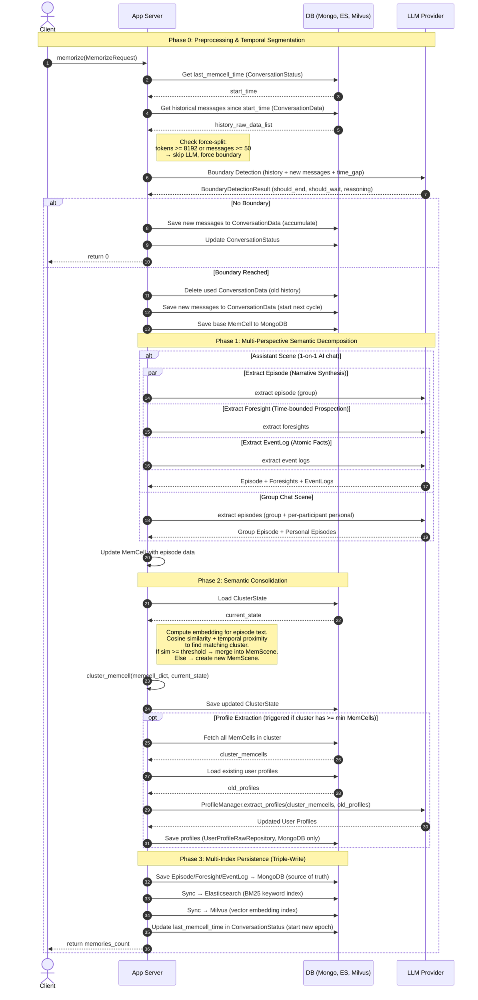

# Data Flow Diagrams for EverMemOS

We just focus on the insertion part.

## Components
- **App Server**: Python FastAPI application. All orchestration logic: boundary detection coordination, extraction dispatch, clustering, persistence orchestration.
- **DB**: All persistent storage. MongoDB (source of truth for MemCells, Episodes, Foresight, EventLog, Profiles, ConversationStatus, ConversationData, ClusterState), Elasticsearch (BM25 keyword index), Milvus (vector embedding index).
- **LLM**: External LLM API provider. Stateless; called for boundary detection, episode synthesis, foresight generation, event log extraction, profile distillation.

### Diagrams



## Data Schemas

All data lives in MongoDB. Elasticsearch and Milvus are **secondary indexes** — they store copies of the same data in different formats for retrieval (BM25 keyword search and vector similarity search). Only Episode, Foresight, and EventLog are triple-written; Profile and ClusterState are MongoDB-only.

### ConversationStatus
**Collection**: `conversation_status` · **Purpose**: Tracks the segmentation epoch — where the last MemCell cut happened.

| Field | Type | Description |
|---|---|---|
| group_id | string | Unique identifier for the conversation group |
| last_memcell_time | datetime | Timestamp of the last segmentation boundary. Messages after this time are "accumulated" waiting for the next boundary |
| old_msg_start_time | datetime | Conversation window read start time |
| new_msg_start_time | datetime | Accumulated new conversation read start time |

### ConversationData
**Collection**: `conversation_data` · **Purpose**: Temporary buffer for accumulated messages between two segmentation boundaries (the "Tumbling window" content).

Each record is a single message, stored as a raw dict with fields like `content`, `speaker_id`, `speaker_name`, `timestamp`, `msgType`, etc.

### MemCell (Conversation Segment)
**Collection**: `memcells` · **Purpose**: One coherent conversation segment after boundary detection. The atomic memory unit. All downstream memories (Episode, Foresight, EventLog) are derived from it.

| Field | Type | Description |
|---|---|---|
| _id / event_id | ObjectId | Auto-generated unique ID |
| original_data | list[dict] | Raw messages in this segment (the conversation text) |
| timestamp | datetime | Timestamp of the last message in the segment |
| summary | string? | Short summary (from LLM boundary detection or empty for force-split) |
| subject | string? | Central topic (filled after Episode extraction) |
| episode | string? | Narrative text (filled after Episode extraction) |
| group_id | string? | Which conversation group |
| participants | list[string]? | Speaker IDs involved |
| type | enum | Always "Conversation" currently |
| keywords | list[string]? | Keywords |
| foresight_memories | list? | Embedded foresight data (rarely used directly) |
| event_log | dict? | Embedded event log data (rarely used directly) |

**Example**:
```json
{
  "_id": "678abc...",
  "original_data": [
    {"speaker_name": "Alice", "content": "I will go to Beijing next week", "timestamp": "2025-01-15T10:00:00Z"},
    {"speaker_name": "Bob", "content": "Really? I was there last month!", "timestamp": "2025-01-15T10:01:00Z"}
  ],
  "timestamp": "2025-01-15T10:01:00Z",
  "summary": "Alice plans a trip to Beijing; Bob shares recent experience",
  "subject": "Beijing Travel Planning",
  "episode": "On Jan 15, Alice mentioned an upcoming trip to Beijing. Bob shared that he visited Beijing recently...",
  "group_id": "group_friends",
  "participants": ["alice_001", "bob_002"]
}
```

### EpisodeMemory (Narrative Summary)
**Collection**: `episodic_memories` · **Also in**: Elasticsearch (`episodic_memories` index) + Milvus (vector collection)
**Purpose**: A concise third-person narrative synthesized from a MemCell. One MemCell → one group Episode + optionally one personal Episode per participant.

| Field | Type | Description |
|---|---|---|
| user_id | string? | null = group episode; "alice_001" = Alice's personal perspective |
| episode | string | The narrative text (e.g., "Alice is planning a trip to Beijing next week...") |
| summary | string | Short summary |
| subject | string? | Central topic |
| timestamp | datetime | When it happened |
| participants | list[string]? | People involved |
| group_id | string? | Group identifier |
| memcell_event_id_list | list[string]? | Which MemCell(s) this was derived from |
| vector | list[float]? | Embedding vector (for Milvus) |

### ForesightRecord (Future Prediction)
**Collection**: `foresight_records` · **Also in**: ES + Milvus
**Purpose**: Time-bounded predictions or planned actions extracted from conversation. Only in assistant (1-on-1 AI) scene.

| Field | Type | Description |
|---|---|---|
| content | string | The prediction text (e.g., "User will travel to Beijing next week") |
| evidence | string? | Supporting evidence from conversation |
| start_time | string? | When this foresight becomes relevant (e.g., "2025-01-20") |
| end_time | string? | When this foresight expires (e.g., "2025-01-27") |
| duration_days | int? | Validity duration |
| parent_type | enum | "memcell" or "episode" — what this was derived from |
| parent_id | string | ID of the parent MemCell/Episode |
| user_id | string? | Whose foresight |
| vector | list[float]? | Embedding vector |

### EventLogRecord (Atomic Fact)
**Collection**: `event_log_records` · **Also in**: ES + Milvus
**Purpose**: Discrete, atomic factual events extracted from conversation. Only in assistant scene.

| Field | Type | Description |
|---|---|---|
| atomic_fact | string | Single factual sentence (e.g., "Alice went to Chengdu on Jan 1, 2024") |
| timestamp | datetime | When the event happened |
| parent_type | enum | "memcell" or "episode" |
| parent_id | string | ID of parent |
| user_id | string? | Whose fact |
| vector | list[float]? | Embedding vector |

### ClusterState (Thematic Grouping State)
**Collection**: `cluster_states` (MongoDB only) · **Purpose**: Tracks incremental semantic clustering of MemCells into thematic groups (called "MemScenes" in the paper).

| Field | Type | Description |
|---|---|---|
| event_ids | list[string] | All MemCell IDs that have been clustered |
| eventid_to_cluster | dict[string→string] | Mapping: MemCell event_id → cluster_id |
| cluster_centroids | dict[string→list[float]] | Each cluster's centroid embedding vector (incrementally updated) |
| cluster_counts | dict[string→int] | Number of MemCells in each cluster |
| cluster_last_ts | dict[string→float] | Last timestamp in each cluster (for temporal proximity check) |
| next_cluster_idx | int | Counter for generating new cluster IDs (cluster_000, cluster_001, ...) |

**Example**:
```json
{
  "event_ids": ["678abc", "678def", "679ghi"],
  "eventid_to_cluster": {"678abc": "cluster_000", "678def": "cluster_000", "679ghi": "cluster_001"},
  "cluster_centroids": {"cluster_000": [0.12, -0.34, ...], "cluster_001": [0.56, 0.78, ...]},
  "cluster_counts": {"cluster_000": 2, "cluster_001": 1},
  "cluster_last_ts": {"cluster_000": 1705305600.0, "cluster_001": 1705392000.0},
  "next_cluster_idx": 2
}
```

### UserProfile (Distilled User Traits)
**Collection**: `user_profiles` (MongoDB only, no ES/Milvus) · **Purpose**: Stable user characteristics distilled from clustered MemCells. Only extracted when a cluster has accumulated enough MemCells (>= threshold).

| Field | Type | Description |
|---|---|---|
| user_id | string | Which user |
| hard_skills | list[dict]? | e.g., `[{"value": "Python", "level": "advanced", "evidences": ["2025-01-15|conv_123"]}]` |
| soft_skills | list[dict]? | Communication, leadership, etc. |
| personality | list[dict]? | Personality traits |
| interests | list[dict]? | Hobbies and interests |
| motivation_system | list[dict]? | What drives the user |
| value_system | list[dict]? | Core values |
| projects_participated | list[dict]? | Project involvement |
| work_responsibility | list[dict]? | Job responsibilities |
| working_habit_preference | list[dict]? | Work style preferences |

Each trait entry follows the pattern: `{"value": "...", "evidences": ["date|conversation_id", ...]}` — traits are evidence-backed.

### Storage Summary

| Data | MongoDB Collection | Elasticsearch | Milvus | When Written |
|---|---|---|---|---|
| ConversationStatus | `conversation_status` | ✗ | ✗ | Every memorize() call |
| ConversationData | `conversation_data` | ✗ | ✗ | Every memorize() call (accumulate/clear) |
| MemCell | `memcells` | ✗ | ✗ | On boundary detection |
| Episode | `episodic_memories` | ✓ | ✓ | After extraction |
| Foresight | `foresight_records` | ✓ | ✓ | After extraction (assistant only) |
| EventLog | `event_log_records` | ✓ | ✓ | After extraction (assistant only) |
| ClusterState | `cluster_states` | ✗ | ✗ | After clustering |
| UserProfile | `user_profiles` | ✗ | ✗ | After profile distillation |

## High-Level Semantic Queries

```sql
-- =====================================================
-- EverMemOS Insertion Workflow as Semantic Queries
-- =====================================================
-- Naming conventions:
--   Recent*   = just produced from current memorize() call (temp / in-flight)
--   History*  = persisted in DB from previous interactions
-- Note: actual implementation partitions by group_id;
--   omitted here for clarity — each user stream runs this flow independently.

-- =============================================================
-- Phase 0: Temporal Segmentation
-- Goal: accumulate messages into a Tumbling window buffer,
--        and seal it when a semantic boundary is detected
-- =============================================================

-- step 0.1: append incoming message to the Tumbling window buffer
insert into RecentMessageTumblingWindow values (:new_message);
-- RecentMessageTumblingWindow: live buffer of all messages since last boundary
-- (maps to ConversationData in implementation)

-- =============================================================
-- Phase 1: Seal, Decompose & Persist
-- Goal: when a semantic boundary is detected, seal the buffer
--        into a segment, decompose into structured memories,
--        and persist for retrieval
-- (steps below only execute when boundary is detected;
--  boundary = token_count >= 8192 or message_count >= 50
--  or sem_filter("Has the conversation reached a natural boundary
--  (topic shift, long time gap, or logical conclusion)?"))
-- =============================================================

-- step 1.1: seal buffer → persistent segment (boundary as gate condition)
insert into HistorySegments
select * from RecentMessageTumblingWindow
where sem_filter(
    content, "Has the conversation reached a natural boundary (topic shift, long time gap, or logical conclusion)?"
) = true
or token_count(content) >= :token_threshold
or message_count(content) >= :message_threshold
as ReadyRecentMessageSegment;
-- if no boundary: this insert is empty, pipeline stops here

-- step 1.2: decompose the segment & persist as memories
-- (HistoryMemories abstracts three tables: HistoryEpisodes, HistoryForesights,
--  HistoryFacts; each triple-writes: MongoDB → Elasticsearch → Milvus)
insert into HistoryMemories (episode, subject, foresights, facts)
select
    sem_map(
        content,
        "Synthesize this conversation into a concise third-person "
        "episodic narrative capturing the key events and context"
    ) as episode,
    sem_map(
        content,
        "What is the central subject of this conversation?"
    ) as subject,
    sem_extract(
        content,
        "Extract time-bounded future predictions or planned actions"
    ) as foresights,                                         -- assistant scene only
    sem_extract(
        content,
        "Extract discrete atomic factual events "
        "(who did what, when, with specific details)"
    ) as facts                                               -- assistant scene only
from ReadyRecentMessageSegment
as RecentMemories;
-- note: in group chat scene, only episode/subject are extracted (no foresights/facts),
--   and episode extraction runs once per participant as well

-- clear buffer and advance segmentation epoch
delete from RecentMessageTumblingWindow
where exists (select 1 from ReadyRecentMessageSegment);
update SegmentationState set last_segmentation_time = :now
where exists (select 1 from ReadyRecentMessageSegment);

-- =============================================================
-- Phase 2: Semantic Consolidation
-- Goal: assign the segment to a thematic topic, and distill
--        stable user traits if enough evidence has accumulated
-- =============================================================

-- step 2.1: assign segment to existing or new topic
upsert into Topic (topic_id, centroid, last_timestamp) -- also increments segment_count
select
    coalesce(
        (select topic_id from Topic
         where sem_sim_join(
             RecentMemories.episode, Topic.centroid,
             "Does this episode belong to the same thematic storyline?"
         ) and time_gap(Topic.last_timestamp, :now) < :max_gap_days
         limit 1),
        new_topic_id()
    ) as topic_id,
    RecentMemories.episode,                                  -- for centroid update
    :now
from RecentMemories
as RecentMemoryTopicAssignment;

-- step 2.2: distill user profile (only when topic has enough segments)
upsert into HistoryProfiles (traits)
select
    sem_agg(
        HistorySegments.episode,
        HistoryProfiles.traits,
        "Given the existing user profile and these conversational episodes, "
        "distill updated stable user traits"
    )
from HistorySegments
    inner join RecentMemoryTopicAssignment on HistorySegments.topic_id = RecentMemoryTopicAssignment.topic_id
    left join HistoryProfiles on true
where (select segment_count from Topic
       where topic_id = RecentMemoryTopicAssignment.topic_id) >= :min_segments;
-- profiles are MongoDB-only (no ES/Milvus sync)
```

### Optional Formulation for Step 2.1 (`sem_group_by`)

```sql
-- Alternative expression of step 2.1:
-- use semantic grouping semantics instead of "sim_join + coalesce(new_topic_id)"
RecentMemoryTopicAssignment as (
    select
        sem_group_by(
            RecentMemories.episode,
            Topic.centroid,
            "Assign this episode to the most suitable thematic storyline; "
            "if no existing topic matches, create a new topic"
        ) as topic_id,
        RecentMemories.episode as episode,
        :now as assigned_at
    from RecentMemories
    where time_gap(Topic.last_timestamp, :now) < :max_gap_days
       or is_new_semantic_group(topic_id) = true
);

-- Then keep the same state update semantics:
-- upsert Topic(topic_id, centroid, last_timestamp, segment_count)
-- from RecentMemoryTopicAssignment
```

Notes:
- This does not change business semantics. It is a cleaner *conceptual* formulation of "topic assignment + possible new-topic creation".
- `sem_group_by` emphasizes that Topic is a continuously maintained semantic grouping state, not just one-shot nearest-neighbor retrieval.
- In the current LOTUS simulation, this still maps to practical primitives (`sem_sim_join` + relational state upsert), because native streaming `sem_group_by` lifecycle APIs are not directly exposed in the same way.
