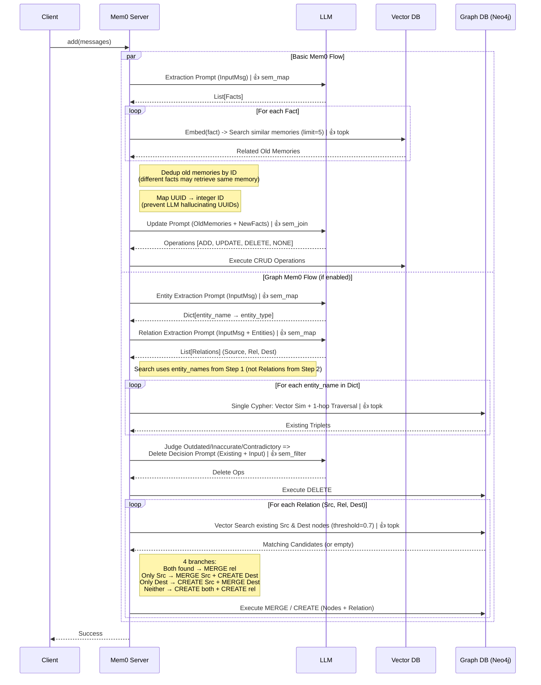
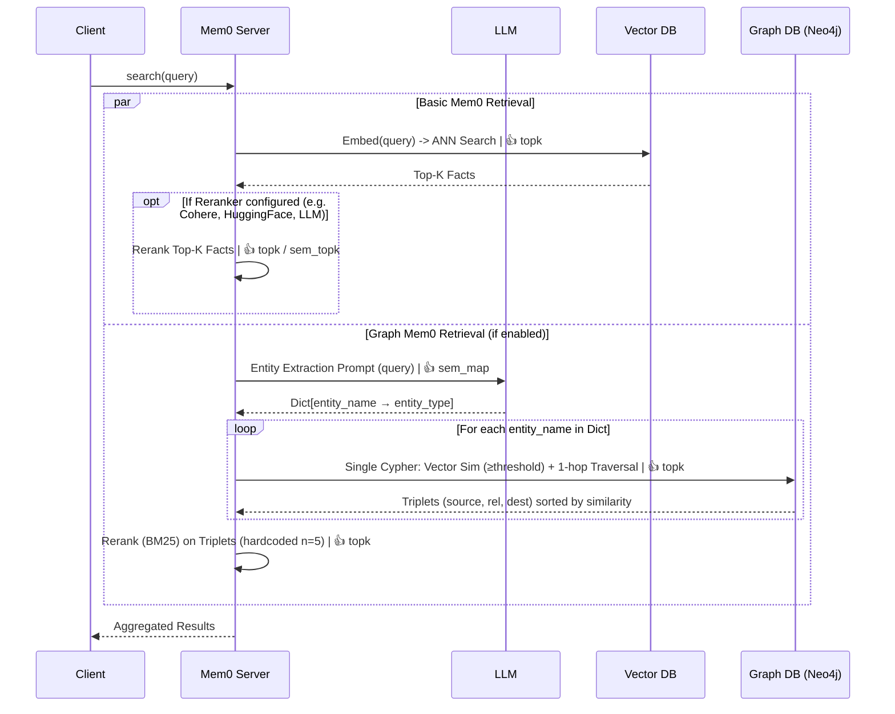

# Data Flow Diagrams for Mem0

## Memory Update



## High-level SQL (LOTUS-style, SQL-pure; Conceptual) for Mem0 Insertion (`add(messages)`)

> Notes
> - This is **conceptual SQL** (not runnable) to capture Mem0’s **logical intent**.
> - Semantic operators (LLM-powered): `sem_map`, `sem_join`, `sem_filter`, `sem_agg`, `sem_topk`.
> - Non-semantic retrieval: `topk(...)` means **pure DB vector similarity top-k** (no LLM).

### A) Basic Mem0 Flow (Vector Store)

```sql
-- func: Memories(memory_id, memory_text, user_id, agent_id, run_id, embedding, created_at, ...)

-- input: CurrentMessage: (text, user_id, agent_id, run_id)

with CurrentFacts as (
    select fact from sem_map(CurrentMessage, 'Extract standalone, self-contained facts from the conversation')
),
FactResolution as (
    select
        CurrentFacts.fact,
        SelectedHistoryFacts.id, -- one-to-many
        SelectedHistoryFacts.fact,
        sem_map(
            CurrentFacts.fact, SelectedHistoryFacts.fact, ['ADD', 'UPDATE', 'DELETE', 'NOOP'],
            "Evaluate the relationship: if contradictory return DELETE, if adding details return UPDATE, if redundant return NOOP, else ADD"
        ) as fact_mem_action,
        sem_map(
            CurrentFacts.fact, SelectedHistoryFacts.fact,
            "If action is UPDATE, merge them into a comprehensive fact. Else return new_content"
        ) as enriched_fact
        -- in real workflow, fact_mem_action and enriched_fact are computed together in one LLM call
    from CurrentFacts
    cross join lateral ( -- or left join in high level
        select * from HistoryFacts where id 
        in sem_topk(CurrentFacts.fact, HistoryFacts.fact, k=5, "find top k similar facts") 
        -- here they use vector anns search, i.e. topk
    ) as SelectedHistoryFacts
)

delete from HistoryFacts where id in (
    select id from FactResolution where fact_mem_action = 'DELETE'
)

upsert into HistoryFacts (id, fact)
select
    case when fact_mem_action = 'UPDATE' then id else generate_uuid() end as id,
    enriched_fact
from FactResolution
where fact_mem_action in ('ADD', 'UPDATE', 'DELETE') -- 'delete' row also has new fact

```

### B) Graph Mem0 Flow (if enabled)

```sql
-- func: Memories(memory_id, memory_text, user_id, agent_id, run_id, embedding, created_at, ...)

-- input: CurrentMessage: (text, user_id, agent_id, run_id)
-- current entity extraction
with CurrentEntities as (
    select entity_name, entity_type 
    from sem_map(CurrentMessage, 'Extract entities from the conversation')
),
-- current relation extraction
CurrentRelations as (
    select src_entity_name, relation_description, dest_entity_name 
    from sem_map(CurrentMessage, CurrentEntities, 'Extract relationship triplets (Source, Relation, Destination)')
),
-- current entity alignment: checking existing entities
CurrentEntityAligned as (
    select
        CurrentEntities.entity_name ,
        CurrentEntities.entity_type,
        coalesce(SelectedHistoryEntities.id, generate_uuid()) as id
    from CurrentEntities
    -- Vector Search (Recall)
    left sem_join lateral (
        select * from HistoryEntities where id 
        in sem_topk(
            CurrentEntities.entity_name, HistoryEntities, k=1, threshold=0.8, "find top k similar entities"
        ) 
    ) as SelectedHistoryEntities
    -- LLM Judge (Precision)
    on sem_map(
        CurrentEntities.entity_name, SelectedHistoryEntities.entity_name, 
        ['SAME', 'DIFFERENT'], "Are these the exact same entity?"
    ) = 'SAME'
),
-- i.e. vector search + llm filter = 
-- left sem_join HistoryEntities
-- on "Do ENTITY and DATABASE ENTITY refer to the same real-world object?"

-- current relation/fact resolution
FactResolution as (
    select
        CurrentRelations.relation_description,
        SrcCurrenEntityAligned.id as src_id,
        DestCurrenEntityAligned.id as dest_id,
        HistoryRelations.id as history_id,
        sem_map(
            CurrentRelations.relation_description,
            HistoryRelations.relation_description,
            ['CONTRADICTS', 'AUGMENTS', 'NEW'], 
            "Does the new relation contradict the old one (CONTRADICTS), add detail (AUGMENTS), or is it unrelated (NEW)?"
        ) as relation_mem_action
    from CurrentRelations
    join CurrentEntityAligned as SrcCurrenEntityAligned on CurrentRelations.src_entity_name = SrcCurrenEntityAligned.entity_name
    join CurrentEntityAligned as DestCurrenEntityAligned on CurrentRelations.dest_entity_name = DestCurrenEntityAligned.entity_name
    left join HistoryRelations
    on SrcCurrenEntityAligned.id = HistoryRelations.src_id 
    or DestCurrenEntityAligned.id = HistoryRelations.dest_id -- 1-hop traversal
)

upsert into HistoryEntities (id, entity_name, entity_type)
select id, entity_name, entity_type from CurrentEntityAligned;

delete from HistoryRelations where id in (
    select id from FactResolution where relation_mem_action = 'CONTRADICTS'
);

upsert into HistoryRelations (id, src_id, dest_id, relation_description)
select 
    case when relation_mem_action = 'AUGMENTS' then id else generate_uuid() end as id,
    src_id, dest_id, relation_description
from FactResolution
where relation_mem_action in ('AUGMENTS', 'NEW', 'CONTRADICTS');

```

## Memory Search


